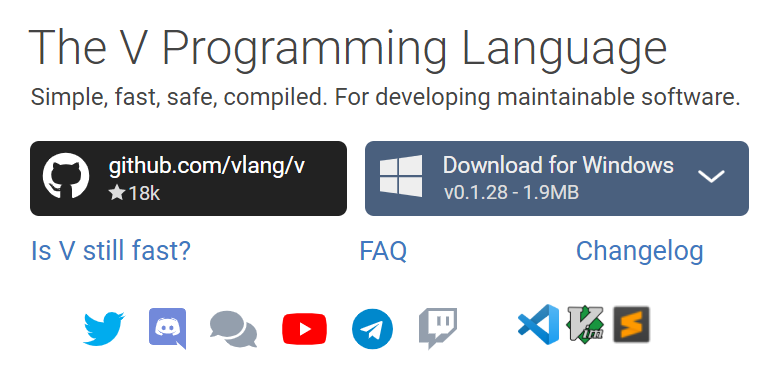

# はじめに

ここにV言語の学習記録をまとめていきます。  
[公式ドキュメント](https://github.com/vlang/v/blob/master/doc/docs.md)を見ながら進めていきます

# 環境構築
Windowsを想定しています。
https://vlang.io/ より、



の右側から適当なものを選んでダウンロード。解凍して`./v`にパスを通す。

## Hello World

```v
fn main() {
    println("hello world")
}
```

を`v run helloWorld.v`  
パスが通っていれば、`hello world`とでる。  
`v --version`で現在のversionが出れば動くはず。

※出力先を指定したい場合  
`v run helloWorld.v -o ./main`

# 目次

- [fizzbuzz](./dev/fizzbuzz/fizzbuzz.md)

# 参考
- [公式ドキュメント](https://github.com/vlang/v/blob/master/doc/docs.md)
- [V プログラミング言語](https://qiita.com/MikuroXina/items/be3d4d9198cab32aed64)